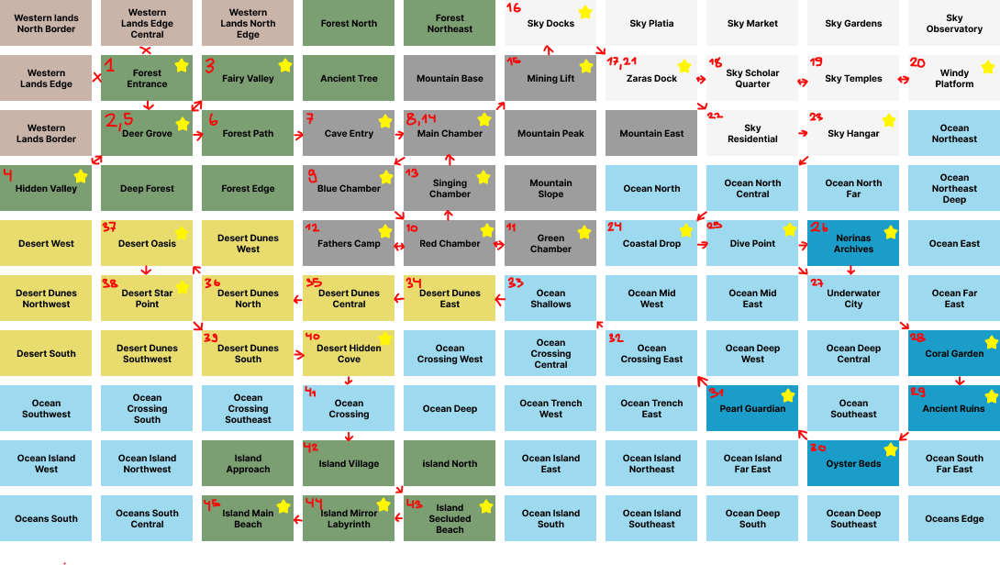

# The Utopian Chronicle - Quadrant Location Map

## Overview
This document maps each quadrant to its corresponding location in the game world. The numbered path represents the intended story progression.
This is just so I understand my own plan better and have more of an overview.
---

## 10x10 Grid System (100 Quadrants)

### Coordinate System
- **Columns**: 1-10 (West → East)
- **Rows**: A-J (North → South)
- **ID Format**: [Row][Column] (e.g. A1 = Row A, Column 1)

---

## ROW A (Northernmost Row)

### A1 - Western Lands North Border
**ID**: A1  
**Location**: Western Lands  
**Function**: Filler - Outside playable main zone, western border

### A2 - Western Lands Edge Central
**ID**: A2  
**Location**: Western Lands  
**Function**: Filler - Western edge zone, not part of main story

### A3 - Western Lands North Edge
**ID**: A3  
**Location**: Western Lands  
**Function**: Filler - Continuation of western border zone

### A4 - Forest North
**ID**: A4  
**Location**: Enchanted Forest  
**Function**: Filler - Northern forest area, atmospheric zone/border zone

### A5 - Forest Northeast
**ID**: A5  
**Location**: Enchanted Forest  
**Function**: Filler - Northeastern forest, transition zone to mountains/border zone

### A6 - Sky Docks
**ID**: A6  
**Location**: Sky City Nephelia  
**Function**: Exploration - Docking stations for airships, worldbuilding

### A7 - Sky Platia
**ID**: A7  
**Location**: Sky City Nephelia  
**Function**: Exploration - Central plaza (Greek: Platia = Plaza)

### A8 - Sky Market
**ID**: A8  
**Location**: Sky City Nephelia  
**Function**: Exploration - Colorful marketplace, cultural atmosphere

### A9 - Sky Gardens
**ID**: A9  
**Location**: Sky City Nephelia  
**Function**: Exploration - Floating gardens, visual atmosphere

### A10 - Sky Observatory
**ID**: A10  
**Location**: Sky City Nephelia  
**Function**: Filler - Border zone

---

## ROW B

### B1 - Western Lands Edge
**ID**: B1  
**Location**: Western Lands  
**Function**: Filler - Northern border of western lands

### B2 - Forest Entrance
**ID**: B2  
**Location**: Enchanted Forest  
**Function**: Start Point - Main entrance to Enchanted Forest, game start

### B3 - Fairy Valley
**ID**: B3  
**Location**: Enchanted Forest  
**Function**: NPC Interaction - Meeting Fairies, tutorial for NPC interaction

### B4 - Ancient Tree
**ID**: B4  
**Location**: Enchanted Forest  
**Function**: Exploration - Sacred tree, home of the fairies

### B5 - Mountain Base
**ID**: B5  
**Location**: Crystal Caves  
**Function**: Filler - Beginning of the mountains

### B6 - Mining Lift
**ID**: B6  
**Location**: Crystal Caves  
**Function**: Puzzle/Transition - Ancient mining lift, transport to Nephelia (critical transition)

### B7 - Zaras Dock
**ID**: B7  
**Location**: Sky City Nephelia  
**Function**: NPC Interaction - Meeting Captain Zara, chronicle page obtained

### B8 - Sky Scholar Quarter
**ID**: B8  
**Location**: Sky City Nephelia  
**Function**: Exploration - Scholar quarter

### B9 - Sky Temples
**ID**: B9  
**Location**: Sky City Nephelia  
**Function**: Exploration - Temple of Nephele, Greek mythology background

### B10 - Windy Platform
**ID**: B10  
**Location**: Sky City Nephelia  
**Function**: Challenge - Cargo retrieval through strong wind currents

---

## ROW C

### C1 - Western Lands Border
**ID**: C1  
**Location**: Western Lands  
**Function**: Filler - Border zone of western lands

### C2 - Deer Grove
**ID**: C2  
**Location**: Enchanted Forest  
**Function**: NPC Interaction - Wise Deer meeting, first hint to next location

### C3 - Forest Path
**ID**: C3  
**Location**: Enchanted Forest  
**Function**: Exploration - Main path through forest to cave entry

### C4 - Cave Entry
**ID**: C4  
**Location**: Crystal Caves  
**Function**: Transition - Entrance to Crystal Caves

### C5 - Main Chamber
**ID**: C5  
**Location**: Crystal Caves  
**Function**: NPC Interaction - Kira's main area, central cave chamber

### C6 - Mountain Peak
**ID**: C6  
**Location**: Crystal Caves / Mountains  
**Function**: Filler - Mountain peak, viewpoint

### C7 - Mountain East
**ID**: C7  
**Location**: Sky City Nephelia Approach  
**Function**: Filler - Border zone

### C8 - Sky Residential
**ID**: C8  
**Location**: Sky City Nephelia  
**Function**: Exploration - Residential district of Sky City, atmosphere

### C9 - Sky Hangar
**ID**: C9  
**Location**: Sky City Nephelia  
**Function**: Exploration - Airship hangar, technical area, go here with Zara to fly over ocean with airship

### C10 - Ocean Northeast
**ID**: C10  
**Location**: Ocean Surface  
**Function**: Filler - Ocean surface northeast, transition to Underwater Realm

---

## ROW D

### D1 - Hidden Valley
**ID**: D1  
**Location**: Western Lands  
**Function**: Quest - Find hurt forest spirit

### D2 - Deep Forest
**ID**: D2  
**Location**: Enchanted Forest  
**Function**: Exploration - Deep forest area, dense vegetation

### D3 - Forest Edge
**ID**: D3  
**Location**: Enchanted Forest  
**Function**: Filler - Forest edge, transition to other areas/border zone

### D4 - Blue Chamber
**ID**: D4  
**Location**: Crystal Caves  
**Function**: Puzzle - Second chamber to find crystal keys, blue color sequence

### D5 - Singing Chamber
**ID**: D5  
**Location**: Crystal Caves  
**Function**: Puzzle/Story Moment - Target room of crystal keys, opening door for Kira so she tells how to continue

### D6 - Mountain Slope
**ID**: D6  
**Location**: Mountains  
**Function**: Filler - Mountain slope between Caves and Sky City/border zone

### D7 - Ocean North
**ID**: D7  
**Location**: Ocean Surface  
**Function**: Filler - Northern ocean surface

### D8 - Ocean North Central
**ID**: D8  
**Location**: Ocean Surface  
**Function**: Filler - North-central ocean surface

### D9 - Ocean North Far
**ID**: D9  
**Location**: Ocean Surface  
**Function**: Filler - Far northern ocean surface

### D10 - Ocean Northeast Deep
**ID**: D10  
**Location**: Ocean Surface  
**Function**: Filler - Deeper northeastern ocean zone

---

## ROW E

### E1 - Desert West
**ID**: E1  
**Location**: Desert of Truth  
**Function**: Exploration - Western desert edge/border zone

### E2 - Desert Oasis
**ID**: E2  
**Location**: Desert of Truth  
**Function**: NPC Interaction - The oasis, meeting Hermit, Father's compass

### E3 - Desert Dunes West
**ID**: E3  
**Location**: Desert of Truth  
**Function**: Exploration - Western dunes

### E4 - Fathers Camp
**ID**: E4  
**Location**: Crystal Caves  
**Function**: Story Moment - Father's old campsite, water flask found

### E5 - Red Chamber
**ID**: E5  
**Location**: Crystal Caves  
**Function**: Puzzle - First chamber where first crystal key is, red color sequence

### E6 - Green Chamber
**ID**: E6  
**Location**: Crystal Caves  
**Function**: Puzzle - Third chamber where crystal key is, green color sequence

### E7 - Coastal Drop
**ID**: E7  
**Location**: Ocean Coast  
**Function**: Transition - Drop from airship into ocean

### E8 - Dive Point
**ID**: E8  
**Location**: Ocean Surface  
**Function**: Transition - Dive point with Kira's crystal, entry to Underwater Realm

### E9 - Nerinas Archives
**ID**: E9  
**Location**: Underwater Realm  
**Function**: NPC Interaction - Nerina's archive, ancient mermaid scholar

### E10 - Ocean East
**ID**: E10  
**Location**: Ocean Surface  
**Function**: Filler - Eastern ocean surface

---

## ROW F

### F1 - Desert Dunes Northwest
**ID**: F1  
**Location**: Desert of Truth  
**Function**: Exploration - Northwestern dunes/border zone

### F2 - Desert Star Point
**ID**: F2  
**Location**: Desert of Truth  
**Function**: Puzzle - Star observation point for star navigation challenge

### F3 - Desert Dunes North
**ID**: F3  
**Location**: Desert of Truth  
**Function**: Exploration - Northern dunes/path

### F4 - Desert Dunes Central
**ID**: F4  
**Location**: Desert of Truth  
**Function**: Exploration - Central dune region/path

### F5 - Desert Dunes East
**ID**: F5  
**Location**: Desert of Truth  
**Function**: Exploration - Path and arrival from underwater realm to desert

### F6 - Ocean Shallows
**ID**: F6  
**Location**: Ocean Surface  
**Function**: Transition - Shallow ocean zone

### F7 - Ocean Mid West
**ID**: F7  
**Location**: Underwater Realm  
**Function**: Exploration - Western mid underwater zone

### F8 - Ocean Mid East
**ID**: F8  
**Location**: Underwater Realm  
**Function**: Exploration - Eastern mid underwater zone

### F9 - Underwater City
**ID**: F9  
**Location**: Underwater Realm  
**Function**: Exploration - Coral castle, where merfolk live

### F10 - Ocean Far East
**ID**: F10  
**Location**: Ocean Surface  
**Function**: Filler - Far eastern ocean surface/border zone

---

## ROW G

### G1 - Desert South
**ID**: G1  
**Location**: Desert of Truth  
**Function**: Exploration - Southern desert, hot zone/border zone

### G2 - Desert Dunes Southwest
**ID**: G2  
**Location**: Desert of Truth  
**Function**: Puzzle - Southwestern dunes, part of star navigation

### G3 - Desert Dunes South
**ID**: G3  
**Location**: Desert of Truth  
**Function**: Exploration/Puzzle - Southern dunes, part of star navigation

### G4 - Desert Hidden Cove
**ID**: G4  
**Location**: Desert of Truth  
**Function**: Story Moment - Hidden cove with Father's boat, departure to island

### G5 - Ocean Crossing West
**ID**: G5  
**Location**: Ocean Crossing  
**Function**: Transition - Further path from underwater realm to desert

### G6 - Ocean Crossing Central
**ID**: G6  
**Location**: Ocean Crossing  
**Function**: Transition - Central crossing, "endless blue"

### G7 - Ocean Crossing East
**ID**: G7  
**Location**: Ocean Crossing  
**Function**: Transition - Eastern crossing/path from underwater to desert

### G8 - Ocean Deep West
**ID**: G8  
**Location**: Underwater Realm  
**Function**: Exploration - Western deep sea

### G9 - Ocean Deep Central
**ID**: G9  
**Location**: Underwater Realm  
**Function**: Exploration - Central deep sea

### G10 - Coral Garden
**ID**: G10  
**Location**: Underwater Realm  
**Function**: Puzzle - First coral cipher chamber, colorful coral formations

---

## ROW H

### H1 - Ocean Southwest
**ID**: H1  
**Location**: Ocean  
**Function**: Filler - Southwestern ocean/border zone

### H2 - Ocean Crossing South
**ID**: H2  
**Location**: Ocean Crossing  
**Function**: Filler - Ocean

### H3 - Ocean Crossing Southeast
**ID**: H3  
**Location**: Ocean Crossing  
**Function**: Transition - Southeastern crossing

### H4 - Ocean Crossing
**ID**: H4  
**Location**: Ocean Crossing  
**Function**: Transition - Main crossing zone to island

### H5 - Ocean Deep
**ID**: H5  
**Location**: Underwater Realm  
**Function**: Exploration - Deep ocean zone, dark

### H6 - Ocean Trench West
**ID**: H6  
**Location**: Underwater Realm  
**Function**: Exploration - Western deep sea trench, dramatically deep

### H7 - Ocean Trench East
**ID**: H7  
**Location**: Underwater Realm  
**Function**: Exploration - Eastern deep sea trench

### H8 - Pearl Guardian
**ID**: H8  
**Location**: Underwater Realm  
**Function**: Puzzle - Pearl Guardian (ancient sea turtle), coral cipher recitation

### H9 - Ocean Southeast
**ID**: H9  
**Location**: Underwater Realm  
**Function**: Exploration - Southeastern underwater zone

### H10 - Ancient Ruins
**ID**: H10  
**Location**: Underwater Realm  
**Function**: Puzzle - Third coral cipher chamber, sunken structures

---

## ROW I

### I1 - Ocean Island West
**ID**: I1  
**Location**: Ocean near Island  
**Function**: Filler - Western island waters/border zone

### I2 - Ocean Island Northwest
**ID**: I2  
**Location**: Ocean near Island  
**Function**: Filler - Northwestern island waters

### I3 - Island Approach
**ID**: I3  
**Location**: Island of Bliss  
**Function**: Story Moment - First sighting of island from boat, "golden beaches"

### I4 - Island Village
**ID**: I4  
**Location**: Island of Bliss  
**Function**: NPC Interaction - Beautiful village, meeting Smiling Ones, arrival on island

### I5 - Island North
**ID**: I5  
**Location**: Island of Bliss  
**Function**: Exploration - Northern island area

### I6 - Ocean Island East
**ID**: I6  
**Location**: Ocean near Island  
**Function**: Filler - Eastern island waters

### I7 - Ocean Island Northeast
**ID**: I7  
**Location**: Ocean near Island  
**Function**: Filler - Northeastern island waters

### I8 - Ocean Island Far East
**ID**: I8  
**Location**: Ocean near Island  
**Function**: Filler - Far eastern island waters

### I9 - Oyster Beds
**ID**: I9  
**Location**: Underwater Realm  
**Function**: Puzzle - Second coral cipher chamber, shells and pearls

### I10 - Ocean South Far East
**ID**: I10  
**Location**: Ocean  
**Function**: Filler - Southeastern ocean, far away/border zone

---

## ROW J (Southernmost Row)

### J1 - Ocean South
**ID**: J1  
**Location**: Ocean  
**Function**: Filler - Southern ocean/border zone

### J2 - Ocean South Central
**ID**: J2  
**Location**: Ocean  
**Function**: Filler - South-central ocean

### J3 - Island Main Beach
**ID**: J3  
**Location**: Island of Bliss  
**Function**: Story Moment - Pristine shores

### J4 - Island Mirror Lab
**ID**: J4  
**Location**: Island of Bliss  
**Function**: Puzzle - Mirror Labyrinth, final challenge with Father

### J5 - Island Secluded Beach
**ID**: J5  
**Location**: Island of Bliss  
**Function**: Story Moment - Secluded beach, meeting Father (Old Man)

### J6 - Ocean Island South
**ID**: J6  
**Location**: Ocean near Island  
**Function**: Transition - Southern island waters

### J7 - Ocean Island Southeast
**ID**: J7  
**Location**: Ocean near Island  
**Function**: Filler - Southeastern island waters

### J8 - Oceans Edge
**ID**: J8  
**Location**: Ocean  
**Function**: Filler - Ocean edge, very far south

### J9 - Ocean Deep South
**ID**: J9  
**Location**: Underwater Realm  
**Function**: Exploration - Deep southern underwater zone

### J10 - Oceans South Central
**ID**: J10  
**Location**: Ocean  
**Function**: Filler - South-central ocean edge

---

## Function Categories - Summary

### Start Point (1)
- B2: Forest Entrance

### Story Moments (6)
- E4: Fathers Camp
- G4: Desert Hidden Cove
- I3: Island Approach
- J3: Island Main Beach
- J5: Island Secluded Beach
- D5: Singing Chamber (+ Puzzle)

### NPC Interaction (6)
- B3: Fairy Valley
- C2: Deer Grove
- C5: Main Chamber (Kira)
- B7: Zaras Dock
- E2: Desert Oasis (Hermit)
- E9: Nerinas Archives
- I4: Island Village (Smiling Ones)
- J5: Island Secluded Beach (Father)

### Puzzle (11)
- D4: Blue Chamber
- D5: Singing Chamber (+ Story)
- E5: Red Chamber
- E6: Green Chamber
- F2: Desert Star Point
- G2: Desert Dunes Southwest
- G3: Desert Dunes South
- G10: Coral Garden
- H10: Ancient Ruins
- I9: Oyster Beds
- J4: Island Mirror Labyrinth

### Challenge (1)
- B10: Windy Platform

### Quest (1)
- D1: Hidden Valley

### Transition (11)
- B6: Mining Lift
- C4: Cave Entry
- E7: Coastal Drop
- E8: Dive Point
- F6: Ocean Shallows
- G5: Ocean Crossing West
- G7: Ocean Crossing East
- G6: Ocean Crossing Central
- H3: Ocean Crossing Southeast
- H4: Ocean Crossing
- J6: Ocean Island South

### Exploration (29)
- B4: Ancient Tree
- B8: Sky Scholar Quarter
- B9: Sky Temples
- C3: Forest Path
- C8: Sky Residential
- C9: Sky Hangar
- D2: Deep Forest
- E1: Desert West
- E3: Desert Dunes West
- F1: Desert Dunes Northwest
- F3: Desert Dunes North
- F4: Desert Dunes Central
- F5: Desert Dunes East
- F7: Ocean Mid West
- F8: Ocean Mid East
- F9: Underwater City
- G1: Desert South
- G8: Ocean Deep West
- G9: Ocean Deep Central
- H5: Ocean Deep
- H6: Ocean Trench West
- H7: Ocean Trench East
- H9: Ocean Southeast
- I5: Island North
- J9: Ocean Deep South
- A6: Sky Docks
- A7: Sky Platia
- A8: Sky Market
- A9: Sky Gardens

### Filler (34)
- A1: Western Lands North Border
- A2: Western Lands Edge Central
- A3: Western Lands North Edge
- A4: Forest North
- A5: Forest Northeast
- A10: Sky Observatory
- B1: Western Lands Edge
- B5: Mountain Base
- C1: Western Lands Border
- C6: Mountain Peak
- C7: Mountain East
- C10: Ocean Northeast
- D3: Forest Edge
- D6: Mountain Slope
- D7: Ocean North
- D8: Ocean North Central
- D9: Ocean North Far
- D10: Ocean Northeast Deep
- E10: Ocean East
- F10: Ocean Far East
- H1: Ocean Southwest
- H2: Ocean Crossing South
- I1: Ocean Island West
- I2: Ocean Island Northwest
- I6: Ocean Island East
- I7: Ocean Island Northeast
- I8: Ocean Island Far East
- I10: Ocean South Far East
- J1: Ocean South
- J2: Ocean South Central
- J7: Ocean Island Southeast
- J8: Oceans Edge
- J10: Oceans South Central

---

## Path Summary

**Intended Progression**:
1. **Enchanted Forest** → Learn about Crystal Caves
2. **Crystal Caves** → Solve crystal key puzzle, take mining lift up
3. **Sky City Nephelia** → Meet Zara, complete windy platform challenge
4. **Underwater Realm** → Solve coral cipher, access archives
5. **Desert of Truth** → Star navigation, find compass
6. **Island of Bliss** → Confront father, Mirror Labyrinth, escape together

---

## Technical Notes

- **Total**: 100 quadrants
- **Story-critical**: 37 quadrants (including critical path)
- **Optional but relevant**: 29 Exploration + 1 Quest = 30 quadrants
- **Filler/Atmosphere**: 34 quadrants
- **Path Hints**: 5 (C2, D5, B7, H8/E9, E2)
- **Items**: Water Flask (E4), Crystal (E8), Compass (E2), Chronicle Book (ending)

---

